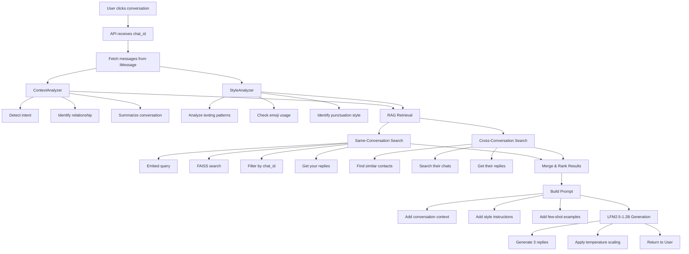
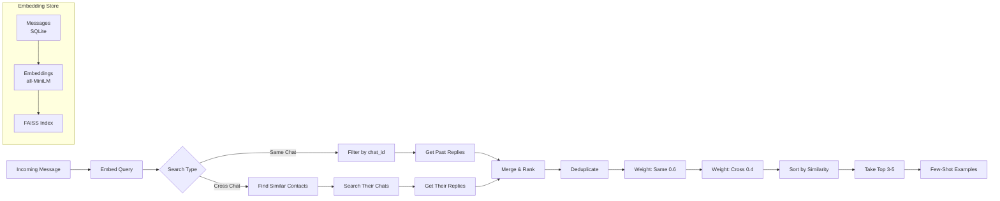
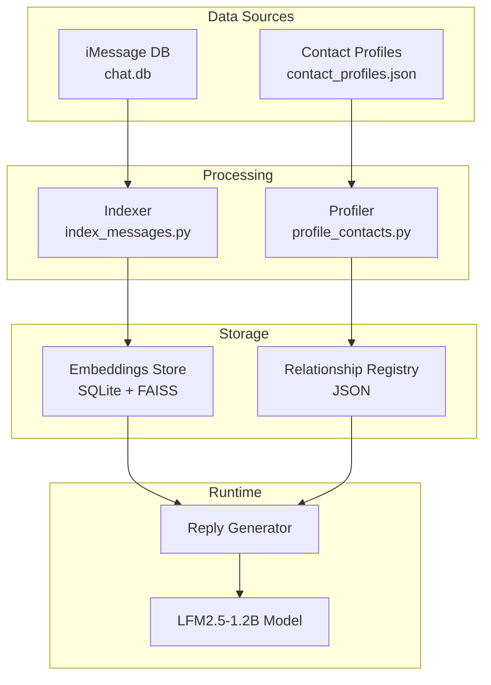
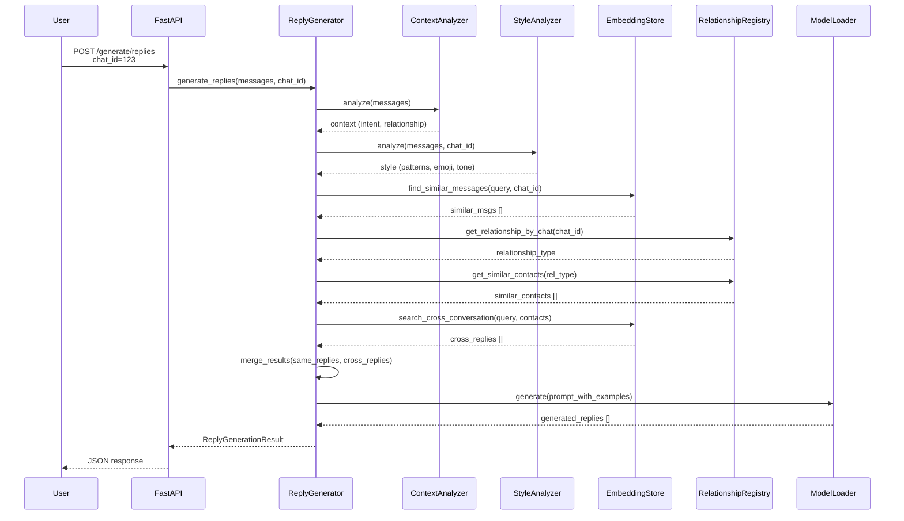
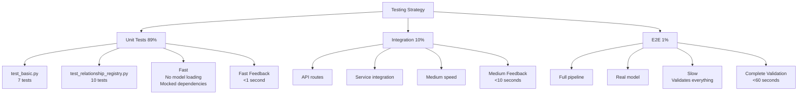
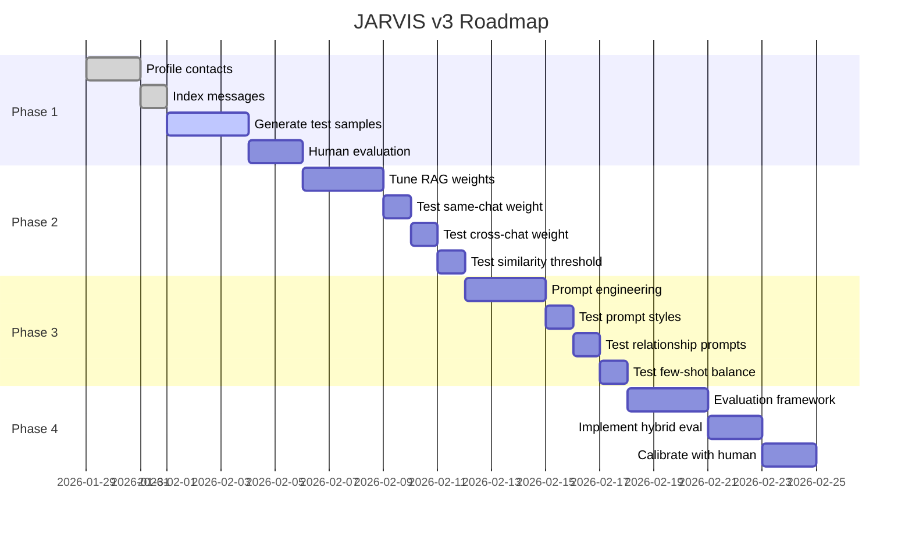

# JARVIS v3 - System Flowcharts

## 1. Complete Request Flow



## 2. RAG System Detail



## 3. Data Architecture



## 4. Component Interaction



## 5. Testing Strategy



## 6. Roadmap Timeline



## 7. Key Decision: Why RAG Works

```mermaid
flowchart TB
    subgraph "Traditional Approach ❌"
        A1[Incoming Message] --> B1[Classify Intent]
        B1 --> C1[Generate with Intent]
        
        D1[Problem: Intent Unpredictable]
        E1["wanna hang?"]
        E1 --> F1[accept?]
        E1 --> G1[decline?]
        E1 --> H1[question?]
        E1 --> I1[reaction?]
    end
    
    subgraph "RAG Approach ✅"
        A2[Incoming Message] --> B2[Find Similar Past]
        B2 --> C2[Show Examples]
        C2 --> D2[Let Model Decide]
        
        E2["wanna hang?"]
        E2 --> F2[Find past "wanna hang?"]
        F2 --> G2[Show your replies]
        G2 --> H2["sure"]
        G2 --> I2["nah busy"]
        G2 --> J2["when?"]
    end
```

## 8. Cross-Conversation Learning

```mermaid
flowchart LR
    subgraph "Chat with Dad"
        A1[Dad: Dinner?]
        B1[You: sure]
        C1[Dad: When?]
        D1[You: 7pm]
        E1[Dad: Dinner?]
    end
    
    subgraph "Chat with Mom"
        A2[Mom: Lunch?]
        B2[You: yeah]
        C2[Mom: When?]
        D2[You: 12pm]
        E2[Mom: Dinner?]
    end
    
    E1 --> F{Same Relationship<br/>family/parent}
    E2 --> F
    
    F --> G[RAG Search]
    G --> H1["sure" (0.9)]
    G --> H2["yeah" (0.85)]
    G --> H3["7pm" (0.6)]
    
    H1 --> I[More Examples]
    H2 --> I
    H3 --> I
    I --> J[Better Replies!]
```
